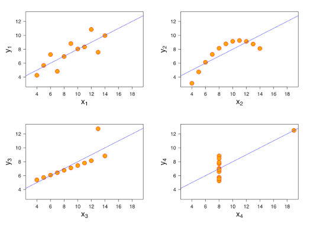

## What We Did

## Key Concepts

### Building Visualizations w/ GGPlot

Anscombe's Quartet: four graphs with vastly different layouts have the same mean, correlation, and regression. This is why we need to analyze the graph, too!

::: callout-tip
A plot is a mapping from columns in your data to visual properties on your page. GG = "grammar of graphics".
:::

### Using GGPlot

P \<- ggplot(data) \# this creates a blank canvas

aes(...) \# aesthetic mappings; not decoration, only tell factual information on where the columns will go on the plot

geom() \# the shape/type of chart

::: callout-tip
ggplot(tract_data) + aes(x=population, y=moe_pct) + geom_point(color=blue)
:::

| Inside aes()             | Not inside aes()        |
|--------------------------|-------------------------|
| aes(Color = reliability) | color = "example_color" |
|                          | decorations             |

### Geometry Options

| What I want to know         | GEOM                        |
|-----------------------------|-----------------------------|
| How a variable is spread    | geom_histogram()            |
| How 2 variables relate      | geom_point()                |
| How 2 variables compare     | geom_boxplot() or geom(col) |
| How things change over time | geom_line()                 |
| How uncertain is a value    | geom_errorbar()             |

### Error Bar Charts

::: callout-tip
county_data %\>% ggplot(aes(x = NAME, y = estimate))

\+ geom_col()

\+ geom_errorbar(aes(ymin = estimate - moe, ymax = estimate + moe))
:::

This plot is extremely messy, and I'll get killed if I turn that in.

{width="385"}

This is a better version that cleans up some of the issues.

::: callout-tip
# reduce to 15 most unreliable.

county_data %\>% arrange(desc(moe_pct))

**%\>% slice_head(n = 15)**

%\>% ggplot(aes(x = NAME, y = estimate))

\+ geom_col()

\+ geom_errorbar(aes(ymin = estimate - moe, ymax = estimate + moe))

## Flip to make names more readable:

county_data %\>% arrange(desc(moe_pct))

%\>% slice_head(n = 15)

%\>% ggplot(aes(x = NAME, y = estimate))

\+ geom_col()

\+ geom_errorbar(aes(ymin = estimate - moe, ymax = estimate + moe))

**+ coord_flip()**

## Sort bars by bar length rather than alphabetically:

county_data %\>% arrange(desc(moe_pct))

%\>% slice_head(n = 15)

**%\>% ggplot(aes(x = reorder(NAME, estimate), y = estimate))**

\+ geom_col()

\+ geom_errorbar(aes(ymin = estimate - moe, ymax = estimate + moe))

\+ coord_flip()

## Remove "County, New York"

county_data %\>% arrange(desc(moe_pct))

**%\>% mutate(NAME = str_remove(NAME, " County, New York"))**

%\>% slice_head(n = 15) %\>% ggplot(aes(x = reorder(NAME, estimate), y = estimate))

\+ geom_col()

\+ geom_errorbar(aes(ymin = estimate - moe, ymax = estimate + moe))

\+ coord_flip()

# Change to narrower width of the error bars

county_data %\>% arrange(desc(moe_pct))

%\>% mutate(NAME = str_remove(NAME, " County, New York"))

%\>% slice_head(n = 15) %\>% ggplot(aes(x = reorder(NAME, estimate), y = estimate))

\+ geom_col()

**+ geom_errorbar(aes(ymin = estimate - moe, ymax = estimate + moe), width = 0.3)**

\+ coord_flip()

# Tidy up with a nice theme:

county_data %\>% arrange(desc(moe_pct))

%\>% mutate(NAME = str_remove(NAME, " County, New York"))

%\>% slice_head(n = 15)

%\>% ggplot(aes(x = reorder(NAME, estimate), y = estimate))

\+ geom_col(fill = "steelblue")

\+ geom_errorbar(aes(ymin = estimate - moe, ymax = estimate + moe), width = 0.3)

\+ coord_flip()

**+ theme_minimal()**

# Fix labels and numbers:

county_data %\>% arrange(desc(moe_pct))

%\>% mutate(NAME = str_remove(NAME, " County, New York"))

%\>% slice_head(n = 15)

%\>% ggplot(aes(x = reorder(NAME, estimate), y = estimate)) + geom_col(fill = "steelblue") +

geom_errorbar(aes(ymin = estimate - moe, ymax = estimate + moe), width = 0.3) + coord_flip() +

theme_minimal() + scale_y_continuous(labels = scales::comma) +

**labs( title = "Counties with the largest margins of error", subtitle = "People below 100% of the poverty level, ACS 2023 5-year estimates", x = NULL, y = "Population below poverty level" )**
:::

{width="599"}

### Coefficient of Variation (CV)

This is a relative measure of sampling error.

Low CV -\> 15%; high reliability

Medium CV-\> 15-30%; medium reliability

High CV -\> 30+%; high sampling error, low reliability

moe_sum() -\> adding estimates together

moe_prop -\> one estimate as share of another

moe_ratio() -\> poverty_num / household_income

::: callout-tip
90% of the time in a normal distribution, the value will fall within 1.645 standard deviations of the mean.
:::

### ACS MOE

- Tells us the 90% confidence interval; a higher value is worse
- Estimate could be 20% +- 3.0 standard deviations
